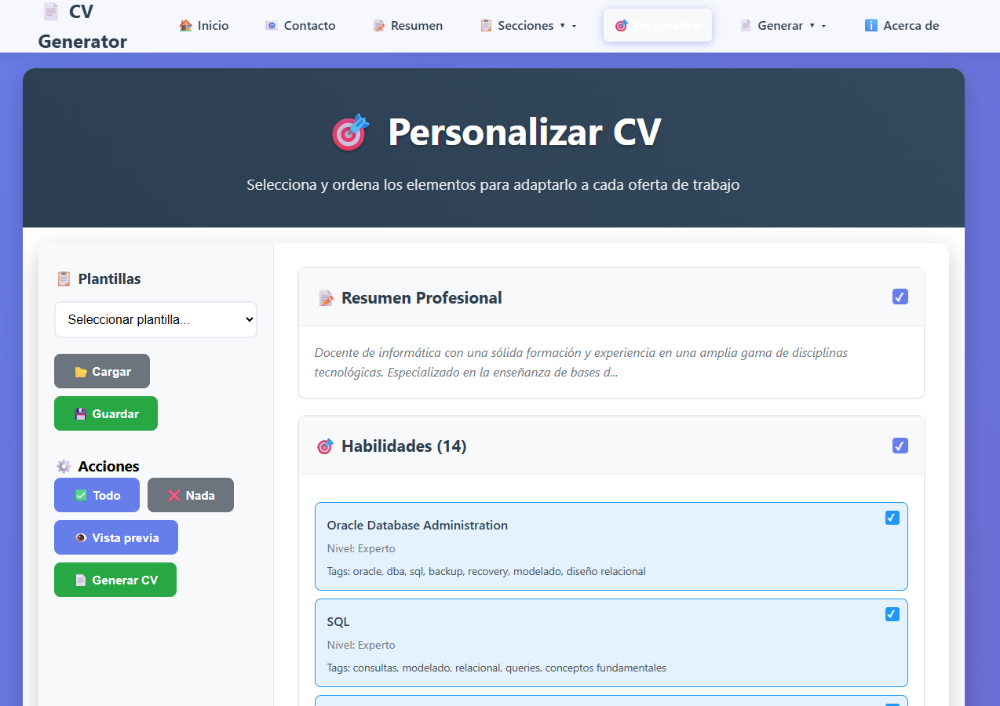
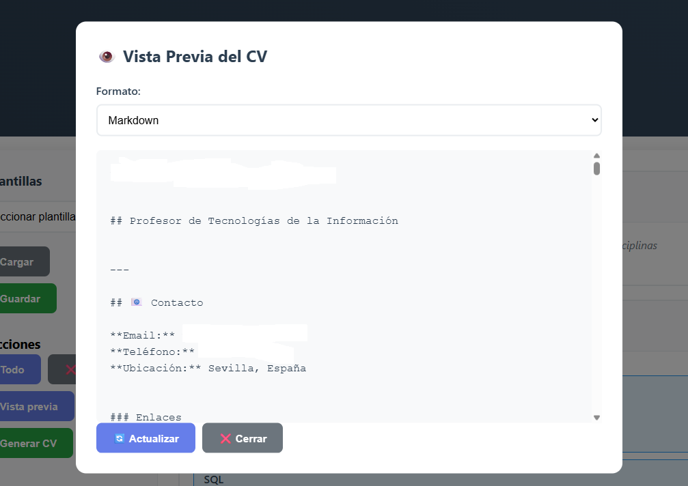

# CV Generator - Generador de Currículums Inteligente

Una aplicación web para crear currículums profesionales personalizados y adaptados a cada oferta de trabajo.


## 🚀 Características principales

- **Personalización inteligente**: Selecciona elementos específicos para cada oferta de trabajo
- **Drag & Drop**: Reordena elementos simplemente arrastrándolos
- **Plantillas reutilizables**: Guarda configuraciones para diferentes tipos de puestos
- **Vista previa en tiempo real**: Ve cómo queda tu CV antes de generarlo
- **Múltiples formatos**: Exporta en Markdown y texto plano
- **Interfaz moderna**: Diseño responsive con animaciones suaves
- **Sin conexión**: Todos los datos se almacenan localmente

## 📋 Secciones del CV

- 📧 **Contacto**: Información personal y enlaces profesionales
- 📝 **Resumen**: Resumen profesional personalizable
- 🎯 **Habilidades**: Gestión de habilidades con niveles y etiquetas
- 💼 **Experiencia**: Historial laboral completo
- 🚀 **Proyectos**: Documentación de proyectos realizados
- 🎓 **Formación**: Educación académica y certificaciones
- 📋 **Otros**: Información adicional y logros

## 🎯 Función destacada: Personalización

La característica principal permite:
- Seleccionar solo elementos relevantes para cada oferta
- Reordenar información por importancia
- Guardar configuraciones como plantillas ("Frontend", "Marketing", etc.)
- Generar CVs específicos en segundos

## 💻 Instalación y uso

### Opción 1: Ejecutable portable (Recomendado)

1. Descarga la última versión desde [Releases](releases/)
2. Extrae el archivo ZIP
3. Ejecuta `CV_Generator.exe`
4. La aplicación se abrirá automáticamente en tu navegador

### Opción 2: Desde código fuente

```bash
# Clonar repositorio
git clone https://github.com/tuusuario/cv-generator.git
cd cv-generator

# Crear entorno virtual
python -m venv cv_env
source cv_env/bin/activate  # Linux/Mac
# o
cv_env\Scripts\activate     # Windows

# Instalar dependencias
pip install -r requirements.txt

# Ejecutar aplicación
python app_dist.py
```

Luego abre tu navegador en `http://127.0.0.1:5000`

## 🛠️ Tecnologías utilizadas

- **Backend**: Python, Flask
- **Frontend**: HTML5, CSS3, JavaScript ES6
- **Templates**: Jinja2
- **UI/UX**: CSS Grid, Flexbox, Animaciones CSS
- **Funcionalidades**: SortableJS para drag & drop
- **Empaquetado**: PyInstaller

## 📖 Documentación

- [Guía de instalación](docs/installation.md)
- [Manual de usuario](docs/user-guide.md)
- [Capturas de pantalla](docs/screenshots/)

## 🎨 Capturas de pantalla

### Interfaz principal


### Personalización inteligente


### Vista previa


## 🚦 Roadmap

- [ ] Exportación a PDF
- [ ] Más plantillas de diseño
- [ ] Importación desde LinkedIn
- [ ] Múltiples idiomas
- [ ] Análisis de palabras clave
- [ ] Integración con ATS

## 🤝 Contribuciones

Las contribuciones son bienvenidas. Para cambios importantes:

1. Fork el proyecto
2. Crea una rama para tu funcionalidad (`git checkout -b feature/AmazingFeature`)
3. Commit tus cambios (`git commit -m 'Add some AmazingFeature'`)
4. Push a la rama (`git push origin feature/AmazingFeature`)
5. Abre un Pull Request

## 📝 Licencia

Este proyecto está bajo la Licencia MIT - ver el archivo [LICENSE](LICENSE) para detalles.

## 👨‍💻 Autor

**Luis Miguel Santana Castaño**
- GitHub: [@Luismi76](https://github.com/Luismi76)
- LinkedIn: [lmsc76](https://linkedin.com/in/lmsc76/)

## ⭐ ¿Te gusta el proyecto?

Si este proyecto te ha sido útil, considera darle una estrella ⭐ y compartirlo.

---

**Versión**: 1.0  
**Estado**: Estable  
**Última actualización**: Septiembre 2025